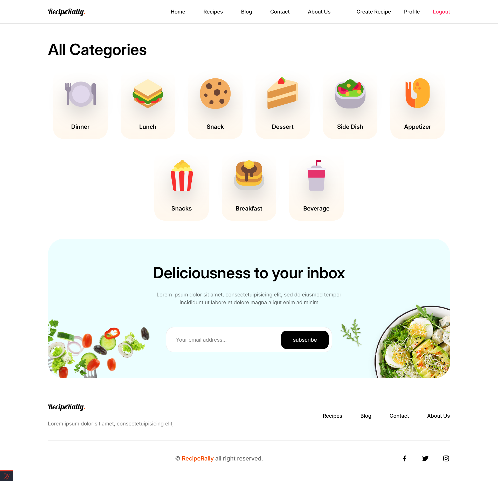

# RecipeRally
RecipeRally is a web application built with Laravel where users can explore and share various recipes. Users can create an account and share their own recipes, as well as review and rate recipes shared by others.

## Screenshots
### Home Page

### Login Page

### Register Page

### All Recipes Page with search, filter and sorting functionality

### Recipe Details Page with rating and review form

### Create Recipe Page

### Edit Recipe Page

### User Profile Page

### Edit User Credentials Page

### User Favorite Recipes Page

### Category Page

### Blog Page

### About Page

### Contact Page

## Features

* User Authentication
* Recipe Creation
* Recipe Review and Rating
* User Profile
* Category Page
* Search, Filtering and sorting
* User Favorite Recipes Page
* Blog Page
* About Page
* Contact Page

## Installation

1. Clone the repository
2. Run `composer install`
3. Run `npm install`
4. Run `php artisan migrate`
5. Run `php artisan db:seed`
6. Run `npm run dev` to build the frontend assets
7. Run `php artisan serve` to start the server

## License

This project is licensed under the MIT License. See the [LICENSE](LICENSE) file for more information.
